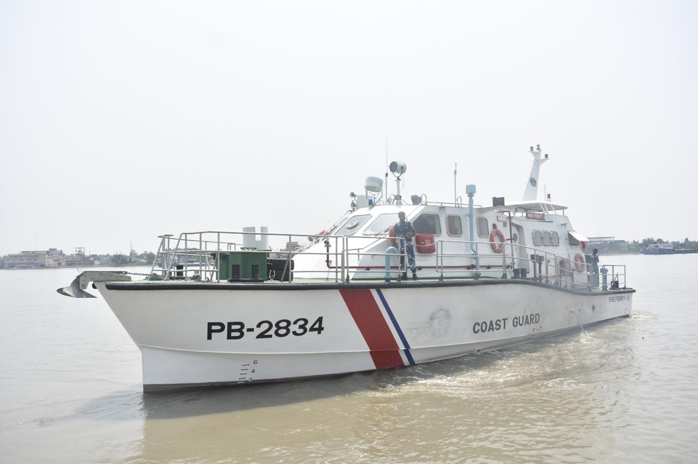

# 🚤 High-Speed Ferry Boat (HSFB)

  

<h2 align="center">02 × High-Speed Ferry Boat (HSFB)</h2>

<b>Bangladesh Coast Guard (BCG)</b> 
Naval Architect | Design Review | Design Management | Structural Detailed Design | Stability Analysis | Class Compliance

---

# 📌 Project Summary

Successfully delivered **02 High-Speed Ferry Boats** for the **Bangladesh Coast Guard (BCG)** in **2022**, enhancing the Coast Guard's capability for rapid personnel transportation, operational logistics, and maritime support.

The **marine-grade aluminum high-speed vessels** were specifically designed to transport Coast Guard personnel between operational bases, stations, and remote coastal locations. The boats provide excellent sea-keeping characteristics and are capable of operating efficiently in **rivers, ports, outer anchorages, coastal waters, and shallow areas near beaches**, ensuring rapid deployment and operational flexibility.

Besides personnel transportation, the vessels are capable of supporting **limited Search and Rescue (SAR)** operations and **patrol duties**, making them valuable multi-role assets for the Bangladesh Coast Guard.

As **Naval Architect**, I contributed to **design review, design management, structural detailed design, hydrostatic and stability analysis, engineering coordination, construction support, and technical compliance**, ensuring successful delivery in accordance with contractual requirements and applicable classification standards.

| **Client** | Bangladesh Coast Guard (BCG) |
|:-----------|:-----------------------------|
| **Vessel Type** | High-Speed Ferry Boat |
| **Quantity** | 02 Boats |
| **Hull Material** | Marine Grade Aluminum |
| **Role** | Naval Architect |
| **Scope** | Design Review • Design Management • Structural Detailed Design • Stability Analysis • Engineering Coordination • Construction Support |
| **Delivery** | 2022 |

---

# 📐 Principal Particulars

| Parameter | Value |
|:----------|------:|
| Hull Material | **Marine Grade Aluminum** |
| Length Overall (LOA) | **20.50 m** |
| Breadth | **6.00 m** |
| Draught | **Approx. 1.20 m** |
| Full Load Displacement | **Approx. 54.14 tonnes** |
| Standard Load Displacement | **Approx. 51.46 tonnes** |
| Light Load Displacement | **Approx. 40.00 tonnes** |
| Maximum Speed | **18 knots** |
| Maximum Continuous Speed | **16 knots** |

---

# 👨‍💼 Engineering Contributions

- Conducted comprehensive **design review** to ensure compliance with contractual specifications and operational requirements.
- Managed multidisciplinary engineering activities throughout the project lifecycle.
- Prepared and reviewed **structural detailed drawings** for marine-grade aluminum hull construction.
- Performed **hydrostatic calculations, intact stability analysis, weight estimation, and loading condition assessments**.
- Reviewed hull structural arrangements, machinery foundations, outfitting layouts, and fabrication documentation.
- Coordinated engineering interfaces among production, procurement, client representatives, and equipment suppliers.
- Supported construction by resolving technical issues, implementing engineering modifications, and ensuring production quality.
- Participated in inspections, harbour acceptance tests (HAT), sea trials (SAT), commissioning, and successful delivery of both vessels.
- Ensured compliance with contractual requirements, quality standards, and applicable classification society rules throughout construction.

---

# ⭐ Operational Capabilities

- High-Speed Personnel Transportation
- Ferrying Coast Guard Personnel
- Operational Logistics Support
- Inland Waterway Operations
- Coastal Operations
- Port & Outer Anchorage Operations
- Limited Search & Rescue (SAR)
- Limited Patrol Duties
- Rapid Response Deployment
- Shallow Water Operations

---

# ⭐ Technical Expertise Demonstrated

**High-Speed Aluminum Craft Design • Design Review • Design Management • Structural Detailed Design • Hydrostatics & Stability • Weight Estimation • Structural Engineering • Engineering Coordination • Production Engineering • Construction Support • Technical Documentation • Quality Assurance • Harbour Acceptance Tests (HAT) • Sea Trials (SAT) • Commissioning**

---

# 💻 Engineering Software

**AVEVA Marine • AutoCAD • Maxsurf (Hydrostatics & Stability) • Rhino3D • ANSYS • FastNEST**

---

# 📬 Contact

**Md. Ariful Islam**

**Senior Naval Architect | Ship Design | Structural Engineering | Stability Analysis | Project Management | Classification Compliance**

📧 **ariful.buet1985@gmail.com**

💼 **https://linkedin.com/in/islam-mdariful**

---

<b>Delivering Safe, High-Performance, and Mission-Ready Maritime Engineering Solutions.</b>

